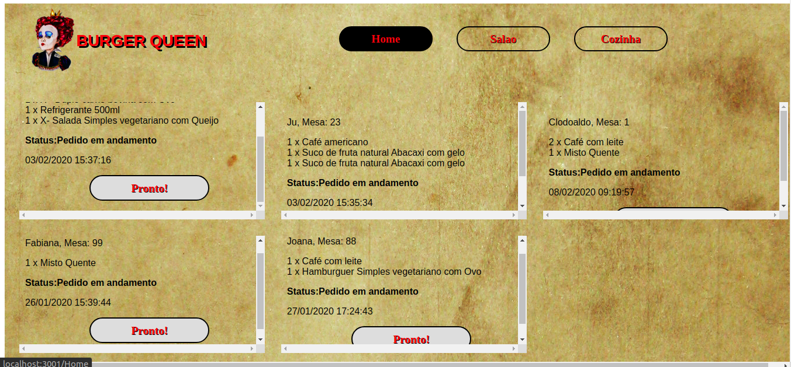
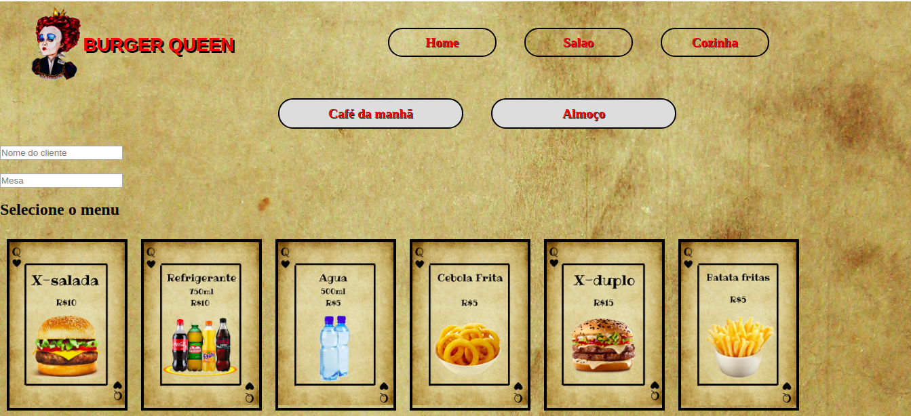

# Burger Queen

#### [História de usuário 1] Cliente deve poder anotar o seu pedido

Eu como cliente quero poder anotar o meu pedido saber o valor de cada 
produto e poder enviar o pedido para a cozinha para ser preparado.

##### Critérios de aceitação

O que deve acontecer para satisfazer as necessidades do usuário?

* Anotar o nome e mesa.
* Adicionar produtos aos pedidos.
* Excluir produtos.
* Ver resumo e o total da compra.
* Enviar o pedido para a cozinha (guardar em algum banco de dados).
* Funcionar bem e se adequar a um _tablet_.

##### Definição de pronto

O acordado abaixo deve acontecer para dizer que a história está terminada:

* Você fez _testes_ de usabilidade e incorporou o _feedback_ do usuário.
* Você deu deploy de seu aplicativo.

***

### Protótipos e layout
Baseado nas necessidades do cliente, criamos um layout no qual pode-se visualizar todos os itens necessários e também à funcionalidade do botão (excluir, adicionar, etc).

#### Framework / biblioteca

* [React Hooks](https://reactjs.org/docs/hooks-intro.html)

#### React Hooks

* [Entendendo React Hooks](https://medium.com/@higornevesmarques/entendendo-react-hooks-2c0efae276a3)
* [React Hooks - Rocketseat](https://blog.rocketseat.com.br/react-hooks/)
* [Habemus React Hooks](https://willianjusten.com.br/habemus-react-hooks/)

#### Ferramentas

* [npm-scripts](https://docs.npmjs.com/misc/scripts)
* [Babel](https://babeljs.io/)
* [webpack](https://webpack.js.org/)
* [Aphrodite](https://github.com/Khan/aphrodite)

#### PWA

* [Seu primeiro Progressive Web App - Google
  developers](https://developers.google.com/web/fundamentals/codelabs/your-first-pwapp/?hl=es)
* [Progressive Web Apps -
  codigofacilito.com](https://codigofacilito.com/articulos/progressive-apps)
* [offlinefirst.org](http://offlinefirst.org/)
* [Usando Service Workers -
  MDN](https://developer.mozilla.org/pt-BR/docs/Web/API/Service_Worker_API/Using_Service_Workers)
* [Como habilitar dados sem conexão - Firebase
  Docs](https://firebase.google.com/docs/firestore/manage-data/enable-offline?hl=es-419) 

#### Serverless

* [Serverless Framework 1.0 - Pagar.me Talks](https://www.youtube.com/watch?v=2oNovfw3V08)
* [Firebase](https://firebase.google.com/)
* [Serverless Architectures - Martin
  Fowler](https://www.martinfowler.com/articles/serverless.html)
 
## Checklist

### `README.md`

* [ ] Documentação do processo de design.
* [ ] Inclui informações para desenvolvedores (dependências, instalação, uso, testes...)

#### HU

#### HU 1: Anotar pedidos

* [x] Digitar o nome do cliente.
* [x] Filtrar _menu_ para _café da manhã_ e _almoço/jantar_.
* [x] Adicionar item ao pedido.
* [x] Excluir item do pedido.
* [x] Mostrar _resumo_ do pedido com todos os itens e o total.
* [x] Enviar para a cozinha (isso deve salvar o pedido).

## Ferramentas utilizadas:

- JavaScript (ES6);
- [React Hooks](https://pt-br.reactjs.org/docs/hooks-intro.html);
- [React Router Dom](https://reacttraining.com/react-router/web/guides/quick-start);
- [React Icons](https://react-icons.netlify.com/#/);
- [Aphrodite](https://github.com/Khan/aphrodite);
- [Firebase](https://firebase.google.com/);
- [Figma](https://www.figma.com);